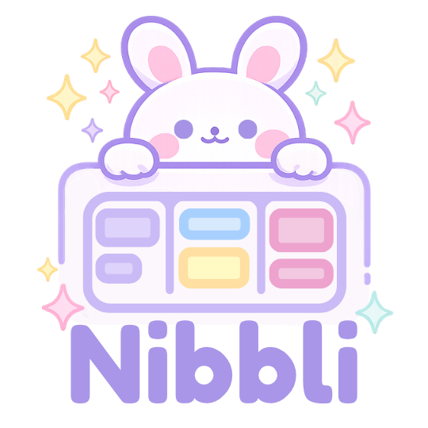

<div align="center">



# Nibbli

**A cozy, real-time collaborative productivity web app for small teams.**

*Final Project — ICT 119: Parallel and Distributed Computing*
*BS Computer Science 3-B2 · 2nd Semester*


</div>

---

## What is Nibbli?

Nibbli is a lightweight real-time collaborative workspace we built for our Parallel and Distributed Computing final project. It lets small teams — like ours — collaborate on a shared Kanban board, chat in workspace rooms, and see each other's presence live, all running locally with no accounts, no cloud infrastructure, and no paid services required.

We designed it to feel cozy and approachable rather than corporate, taking visual inspiration from productivity tools like Trello, Notion, and Discord — but wrapped in a soft pastel aesthetic that makes it actually pleasant to use during late-night project sessions.

The name *Nibbli* came from wanting something small, cute, and collaborative — like nibbling on tasks together.

---

## Theme & Design

Nibbli's visual identity is built around a **cozy pastel** palette that keeps the UI calm and readable even during intense collaboration sessions.

| Token | Color | Use |
|---|---|---|
| `nibbli-bg` | `#FAF7FF` — soft lavender white | Page & panel backgrounds |
| `nibbli-purple` | `#C4B5FD` — pastel purple | Primary accents, To Do column |
| `nibbli-purpleDark` | `#7C3AED` — deep violet | Buttons, active states, your chat bubbles |
| `nibbli-pink` | `#FBCFE8` — pastel pink | In Progress column, secondary accents |
| `nibbli-yellow` | `#FDE68A` — pastel yellow | Highlights, Done column |
| `nibbli-blue` | `#BAE6FD` — pastel blue | Info states, user colors |
| `nibbli-border` | `#EDE9FE` — light lavender | Card borders, dividers |
| `nibbli-text` | `#4B4B6B` — soft dark purple-grey | Body text |

Typography is **Inter** across the board — clean, modern, and easy to read at every size. All components use rounded corners (`rounded-xl`, `rounded-xl2`, `rounded-xl3`) and soft box shadows (`shadow-card`, `shadow-panel`) to keep the interface feeling tactile without being heavy.

The cursor system uses custom SVG assets (`Hand.svg`, `Click.svg`, `Grabbing.svg`, `Hehe.svg`) that replace the native browser cursor entirely inside the board — one of our favorite polish details.

---

## Features

### Core Collaboration
- **Shared Kanban Board** — Three columns (To Do, Doing, Done) synchronized in real time across all connected users. Drag cards between columns and everyone sees it instantly.
- **Workspace Rooms** — Three pre-built rooms: Thesis Team, Finals Project, and Study Group. Each room has its own isolated board, chat, and activity history.
- **Real-Time Chat** — Per-room messaging with pastel message bubbles, user avatars, timestamps, and auto-scroll. Messages persist for the session.
- **Activity Feed** — A live log of everything that happens in a room. Task created, moved, deleted, user joined or left — all timestamped and color-coded.
- **Online User Tracking** — The sidebar shows exactly who is currently in your room with a live green indicator. Disappears automatically when someone disconnects.

### Board Experience
- **Drag and Drop** — Powered by `@dnd-kit`. Cards highlight their target column on hover, and a ghost card follows the cursor during drag. All movement syncs to the server and broadcasts to the room.
- **Task Editing Indicator** — When a teammate is editing a task, others see a subtle "AJ is editing…" label on that card in real time.
- **Typing Indicator** — The chat shows animated bouncing dots with the typist's name while they're composing a message. Auto-clears after 2.5 seconds of inactivity.

### Live Cursor Presence
This was the most technically interesting feature we built. While on the Board tab, every user's cursor is visible to their teammates in real time — like Figma or Miro.

- **Custom SVG Cursors** — The native browser cursor is hidden entirely inside the board. Your cursor is rendered as a React overlay using your team color and username label.
- **Four Cursor States** — `Hand` (default), `Click` (left mouse down), `Grabbing` (dragging a card), `Hehe` (right-click easter egg 🐰).
- **Hover Detection** — Hovering any interactive element (buttons, cards, inputs) automatically switches to the Click cursor, making the board feel tactile.
- **Right-Click Easter Egg** — Hold right-click to keep the Hehe cursor and play a sound effect. Releases back to normal on mouse up.
- **Smooth Interpolation** — Remote cursors use `requestAnimationFrame` with lerp smoothing so they glide rather than teleport.
- **Drag Sync Fix** — We switched to `window pointermove` (instead of board `mousemove`) so cursor updates continue uninterrupted even during `@dnd-kit`'s pointer capture.

### Connection Status
- **Live / Reconnecting badge** — A small pill in the header shows real-time socket connection status. Goes green with a pulse animation when connected, red when recovering.

---

## Distributed Architecture

This is the academic core of the project. Nibbli was deliberately designed to demonstrate four specific distributed systems concepts from our course.

### 1. Client-Server Architecture
Every browser running Nibbli is an independent client. They all connect to a single Node.js server which is the authoritative source of truth for all state — tasks, messages, activity, and who is online. No client stores permanent data; everything lives on the server. If you refresh, you reconnect and receive the current state from the server.

```
Browser (Kia)  ──┐
Browser (Kaye) ──┼──► Node.js + Socket.IO Server ──► broadcasts to all
Browser (AJ)   ──┘
```

### 2. Event-Driven Communication
Nothing in Nibbli polls the server. Instead, the system is entirely event-driven through Socket.IO. When Kaye moves a task, her browser emits a `task:move` event. The server processes it and emits `task:moved` back to every client in the room. Each client's event listener updates React state, which re-renders only the affected component.

This is a fundamental shift from traditional HTTP request-response: the server *pushes* updates as they happen rather than waiting to be asked.

**Key socket events:**

| Direction | Event | Meaning |
|---|---|---|
| Client → Server | `user:join` | Register name and receive room list |
| Client → Server | `room:join` | Subscribe to a workspace room |
| Client → Server | `task:create` | Create a new task |
| Client → Server | `task:move` | Move task to a different column |
| Client → Server | `task:delete` | Delete a task |
| Client → Server | `chat:send` | Send a chat message |
| Client → Server | `chat:typing` | Notify others of typing activity |
| Client → Server | `cursor:move` | Broadcast cursor position + state |
| Client → Server | `cursor:leave` | Remove cursor from others' boards |
| Server → Client | `room:state` | Full room snapshot on join |
| Server → Client | `task:created` | New task to render |
| Server → Client | `task:moved` | Task column change |
| Server → Client | `task:deleted` | Task to remove |
| Server → Client | `chat:message` | New chat message |
| Server → Client | `activity:new` | New activity feed entry |
| Server → Client | `users:update` | Updated online user list |
| Server → Client | `cursor:update` | Remote user cursor position |
| Server → Client | `cursor:userLeft` | Remove remote cursor |

### 3. Real-Time Synchronization
When a user joins a room, the server sends a complete `room:state` snapshot — all tasks, all chat messages, all activity entries, and all currently connected users — in a single payload. After that, incremental events keep every client's view synchronized.

The key challenge here is keeping multiple clients consistent without a database. We solved it with a simple **last-write-wins** strategy on the server's in-memory store: all state mutations happen server-side and are immediately broadcast, so every client converges to the same state.

### 4. Concurrency
Multiple users can act simultaneously — Kia can create a task while Kaye moves one and AJ sends a message, all at the same instant. Node.js handles this through its single-threaded event loop: concurrent socket events are queued and processed sequentially, which naturally serializes writes to the in-memory store without race conditions or locking mechanisms.

In practice this means the system handles simultaneous operations correctly without any special concurrency primitives.

---

## Tech Stack

| Layer | Technology | Why we chose it |
|---|---|---|
| **Frontend UI** | React 18 | Component model maps cleanly to collaborative UI elements |
| **Build Tool** | Vite 5 | Fast HMR, simple config, great DX for a class project |
| **Styling** | TailwindCSS 3 | Utility classes made iterating on the cozy theme fast |
| **Drag and Drop** | @dnd-kit | Modern, React 18 compatible, accessible DnD primitives |
| **Backend Runtime** | Node.js 18+ | Non-blocking I/O handles many concurrent WebSocket connections well |
| **HTTP Server** | Express.js | Minimal setup, just enough for the health endpoint and Socket.IO mount |
| **Real-Time** | Socket.IO 4 | WebSocket with automatic fallback, built-in rooms, event naming |
| **Storage** | In-Memory (plain JS) | No database setup — simple objects store all state for the session |
| **Font** | Inter (Google Fonts) | Clean, modern, great at small sizes |

We intentionally kept the stack minimal. No TypeScript, no state management library, no ORM, no cloud dependencies. Everything runs with two `npm run dev` commands.

---

## Project Structure

```
nibbli/
│
├── backend/
│   └── src/
│       ├── server.js            # Express + Socket.IO server entry point
│       ├── socketHandlers.js    # All real-time event handlers (the server brain)
│       ├── store.js             # In-memory data store — tasks, messages, users
│       └── uuid.js              # Tiny UUID v4 generator, no extra dependency
│
├── frontend/
│   ├── public/
│   │   ├── cursors/             # SVG cursor assets served as static files
│   │   │   ├── Hand.svg         # Default cursor
│   │   │   ├── Click.svg        # Left-click + hover state
│   │   │   ├── Grabbing.svg     # Active drag state
│   │   │   └── Hehe.svg         # Right-click easter egg
│   │   └── sounds/
│   │       └── faaah.mp3        # Easter egg sound effect
│   │
│   └── src/
│       ├── assets/              # Bundled image assets (logos)
│       ├── context/
│       │   └── SocketContext.jsx    # Single shared Socket.IO connection
│       ├── hooks/
│       │   ├── useNibbli.js         # All board + chat state and server actions
│       │   └── useCursor.js         # Live cursor presence — state, emits, remote sync
│       └── components/
│           ├── JoinScreen.jsx        # Name entry welcome screen
│           ├── Workspace.jsx         # Main layout — sidebar, center panel, activity
│           ├── Sidebar.jsx           # Room list + online users panel
│           ├── ChatPanel.jsx         # Real-time per-room chat
│           ├── KanbanBoard.jsx       # DnD board root — columns + cursor overlay
│           ├── KanbanColumn.jsx      # Single column with add-task form
│           ├── TaskCard.jsx          # Draggable task card
│           ├── ActivityFeed.jsx      # Right panel live event log
│           ├── CursorOverlay.jsx     # Renders all remote user cursors
│           ├── LocalCursor.jsx       # Renders the local user's own cursor
│           ├── RemoteCursor.jsx      # Single remote user cursor with lerp smoothing
│           ├── ConnectionBadge.jsx   # Live / Reconnecting status pill
│           └── RoomEmptyState.jsx    # Shown before a room is selected
```

---

## Local Setup

### Prerequisites

- **Node.js v18+** — [nodejs.org](https://nodejs.org) (LTS recommended)
- **npm** — comes bundled with Node.js
- **VS Code** — [code.visualstudio.com](https://code.visualstudio.com)

Verify your installation:
```bash
node -v   # should show v18.x.x or higher
npm -v    # should show 9.x.x or higher
```

---

### Installation

Open VS Code, open the `nibbli` folder, then open **two separate terminals**.

**Terminal 1 — Backend**
```bash
cd backend
npm install
```

**Terminal 2 — Frontend**
```bash
cd frontend
npm install
```

---

### Running the App

**Terminal 1 — Start the backend**
```bash
cd backend
npm run dev
```

You should see:
```
✨ Nibbli backend running → http://localhost:3001
```

**Terminal 2 — Start the frontend**
```bash
cd frontend
npm run dev
```

You should see:
```
  VITE v5.x.x  ready in xxx ms
  ➜  Local:   http://localhost:5173/
```

Open **http://localhost:5173** in your browser.

---

### Testing Multi-User Collaboration

To properly test the real-time features, open **three browser windows** and simulate the team:

1. Open `http://localhost:5173` in Window 1 — enter name **Kia**
2. Open `http://localhost:5173` in Window 2 — enter name **Kaye**
3. Open `http://localhost:5173` in Window 3 — enter name **AJ**
4. All three join the same room (e.g., **Finals Project**)

**Things to try:**
- Create a task in one window — see it appear in all three instantly
- Drag a task to a different column — everyone's board updates
- Open the Chat tab and send messages between windows
- Switch to Board and move your cursor — others see it live
- Right-click on the board for the easter egg 🐰
- Close a window — that user disappears from the online list

---

## Troubleshooting

**Backend won't start**
- Check that port 3001 is free: `netstat -ano | findstr :3001` (Windows) or `lsof -i:3001` (Mac/Linux)
- Kill the process using that port, then try again

**Frontend can't connect to backend**
- Confirm the backend terminal shows the `✨ Nibbli backend running` message
- Check browser DevTools Console for WebSocket errors
- Make sure both are running at the same time

**"Module not found" after pulling from git**
```bash
cd backend  && npm install
cd frontend && npm install
```

**Cursors not showing**
- SVG files must be in `frontend/public/cursors/` (not `src/assets/cursors/`)
- Filenames are case-sensitive: `Hand.svg`, `Click.svg`, `Grabbing.svg`, `Hehe.svg`

---

## Developers

Built with a lot of late nights and pastel colors for our Parallel and Distributed Computing final project. 💜

| Name | Role |
|---|---|
| **Kia I. Soguilon** | Full-Stack Development, UI/UX Design, Real-Time Systems |
| **Kaye C. Emperado** | Full-Stack Development, Frontend Architecture, Chat System |
| **Anthony Joseph G. Dionio** | Full-Stack Development, Backend Architecture, Socket.IO Integration |

*BS Computer Science 3-B2 · ICT 119 — Parallel and Distributed Computing*
*Information Systems and Technology Unit — Second Semester*

---

<div align="center">

Made with 💜 · Nibbli © 2025

</div>
